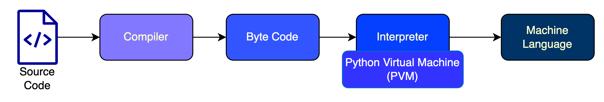

1. ### What is Python?
                
        Python is a widely-used general-purpose, high-level programming language. It was created by Guido van Rossum in 
        1991 and further developed by the Python Software Foundation. It was designed with an emphasis on code 
        readability, and its syntax allows programmers to express their concepts in fewer lines of code.
2. ### Is Python a compiled language or an interpreted language?

       Python is often described as both a compiled and an interpreted language. 
       Here’s why:

       Compilation to Bytecode: When you run a Python program, the source code is first compiled into bytecode 
       (a lower-level, platform-independent representation). This bytecode is stored in .pyc files in the __pycache__ 
       folder.

       Interpretation of Bytecode: The bytecode is then executed by the Python Virtual Machine (PVM), which interprets  
       it line by line.

       So, Python involves both compilation (to bytecode) and interpretation (of the bytecode). Despite this, Python is 
       commonly referred to as an interpreted language because the compilation step is typically hidden from the user 
       and the focus is on the interpreted execution.
   

3. ### What does the ‘#’ symbol do in Python?
       
       In Python, the # symbol is used to create a comment. Comments are lines in the code that are ignored by the 
       Python interpreter and are typically used to explain the code, make notes, or temporarily disable certain lines 
       of code during development.

   ###### Example:
   ```python      
   # This is a single-line comment
   # print("Hello, World!")  # This is an inline comment
   ```

4. ### What is a docstring in Python?

       A docstring in Python is a string literal that appears right after the definition of a function, method, class, 
       or module. It is used to document what the function, method, class, or module does. Unlike comments, docstrings 
       are stored as an attribute of the object they document and can be accessed programmatically.
       
   ###### Syntax:
         
       A docstring is written using triple quotes, either """ or ''', and is placed as the first statement inside a  
       function, class, or module.
    
   ###### Example:
   ```python
   def greet(name):
       """
       This function greets the person passed as a parameter.
       
       Parameters:
       name (str): The name of the person to greet.
       
       Returns:
       str: A greeting message.
       """
       return f"Hello, {name}!"
   ```
   ###### Accessing Docstrings:
       You can access the docstring using the __doc__ attribute or with the help() function.
   ```python
   print(greet.__doc__)
   ```
   ###### Output:
   ```vbnet
   This function greets the person passed as a parameter.
   
   Parameters:
   name (str): The name of the person to greet.
   
   Returns:
   str: A greeting message.
   ```
   ###### Key Points:
   * Docstrings are mainly used for generating documentation automatically.
   * They are useful for explaining what a function, class, or module does, making your code more understandable.
   * They are typically formatted in a specific style, such as PEP 257 or reStructuredText, for consistency.

5. ### What is the difference between a Mutable datatype and an Immutable datatype?
       
       In Python, data types are categorized as mutable or immutable based on whether the object can be changed after 
       it is created.
   ### Mutable Data Types:
   *  Definition: Mutable data types can be changed after their creation. You can modify the content, size, or structure
      of a mutable object without creating a new object.
   * Examples: Lists, dictionaries, sets, byte arrays.
   ###### Example:
   ```python
   my_list = [1, 2, 3]
   my_list[0] = 10  # Changing the first element
   print(my_list)  # Output: [10, 2, 3]
   ```
   ### Immutable Data Types:
   * Definition: Immutable data types cannot be changed after their creation. If you attempt to alter an immutable 
     object, a new object is created instead.
   * Examples: Strings, tuples, integers, floats, frozensets.
   ###### Example:
   ```python
   my_tuple = (1, 2, 3)
   # Attempting to change the first element will result in an error
   # my_tuple[0] = 10  # This will raise a TypeError
   ```
6. ### How are arguments passed in Python: by value or by reference?

       None. 
   In Python, arguments are not strictly passed by value or by reference. Instead, they are passed by object reference.
   Immutable objects seem to follow pass-by-value behavior, while mutable objects behave more like pass-by-reference.
   Here's how it works:
   * When you pass a value to a function, both the passed argument and the variable inside the function share the same 
     memory address (object ID).

   * For immutable objects (e.g., integers, strings, tuples), if you modify the value within the function, 
     Python creates a new object with a different memory address. This happens because immutable objects cannot be 
     altered in place, so a new object is created when a change occurs.

   * For mutable objects (e.g., lists, dictionaries), changes made within the function affect the original object, 
     as both references point to the same memory address.
   
   #### Immutable Data Types
       These include integers, floats, strings, and tuples. When you modify them inside a function, a new object is 
       created with a different memory address.
   ###### Example with an Integer:
   ```python
   def modify_int(x):
       print("Initial ID of x:", id(x))
       x += 10  # This creates a new integer object
   
       print("ID of x after modification:", id(x))
   
   a = 5
   print("ID of a before function call:", id(a))
   modify_int(a)
   print("ID of a after function call:", id(a))
   ```
   ###### Output:
       ID of a before function call: 140719612682832
       Initial ID of x: 140719612682832
       ID of x after modification: 140719612682992
       ID of a after function call: 140719612682832
   
   ###### Example with a String:
   ```python
   def modify_string(s):
       print("Initial ID of s:", id(s))
       s += " World"  # This creates a new string object
       print("ID of s after modification:", id(s))

   text = "Hello"
   print("ID of text before function call:", id(text))
   modify_string(text)
   print("ID of text after function call:", id(text))
   ```
   
   ###### Output:
       ID of text before function call: 4336637664
       Initial ID of s: 4336637664
       ID of s after modification: 4336831344
       ID of text after function call: 4336637664

   #### Mutable Data Types
       These include lists, dictionaries, and sets. When you modify them inside a function, the original object is 
       affected since the ID remains the same.

   ###### Example with a List:
   ```python
   def modify_list(lst):
       print("Initial ID of lst:", id(lst))
       lst.append(4)  # Modifies the original list
       print("ID of lst after modification:", id(lst))
   my_list = [1, 2, 3]
   print("ID of my_list before function call:", id(my_list))
   modify_list(my_list)
   print("ID of my_list after function call:", id(my_list))
   ```
   
   ###### Output:
       ID of my_list before function call: 4370319744
       Initial ID of lst: 4370319744
       ID of lst after modification: 4370319744
       ID of my_list after function call: 4370319744
   
   ###### Example with a Dictionary:
   ```python
   def modify_dict(d):
       print("Initial ID of d:", id(d))
       d["new_key"] = "new_value"  # Modifies the original dictionary
       print("ID of d after modification:", id(d))

   my_dict = {"key": "value"}
   print("ID of my_dict before function call:", id(my_dict))
   modify_dict(my_dict)
   print("ID of my_dict after function call:", id(my_dict))
   ```
   
   ###### Output:
       ID of my_dict before function call: 4300240640
       Initial ID of d: 4300240640
       ID of d after modification: 4300240640
       ID of my_dict after function call: 4300240640

   ###### Example with a Tuple:
   ```python
   def modify_tuple(t):
       print("Initial ID of t:", id(t))
       t += (4, 5)  # This creates a new tuple object
       print("ID of t after modification:", id(t))

   my_tuple = (1, 2, 3)
   print("ID of my_tuple before function call:", id(my_tuple))
   modify_tuple(my_tuple)
   print("ID of my_tuple after function call:", id(my_tuple))
   ```
   
   ###### Output:
       ID of my_tuple before function call: 4311023168
       Initial ID of t: 4311023168
       ID of t after modification: 4311169552
       ID of my_tuple after function call: 4311023168
   
   ###### Key Takeaway:
       Even though tuples are immutable, if they contain mutable elements like lists, those elements can still be 
       changed without altering the tuple's structure or memory address.
   ###### Example
   ```python
   def modify_tuple_with_list(t):
       print("Initial ID of t:", id(t))
       print("Initial ID of t[1]:", id(t[1]))  # ID of the list inside the tuple

       t[1].append(4)  # Modifying the list inside the tuple

       print("ID of t after modifying the list:", id(t))  # Tuple ID remains unchanged
       print("ID of t[1] after modification:", id(t[1]))  # List ID remains unchanged

   my_tuple = (1, [2, 3])  # A tuple containing a list
   print("ID of my_tuple before function call:", id(my_tuple))
   modify_tuple_with_list(my_tuple)
   print("ID of my_tuple after function call:", id(my_tuple))
   print("Modified tuple:", my_tuple)
   ```
   #### Run the code to understand it more clearly: [CODE](..%2Fexamples%2Fpass_by_assignment.py)
   
7. ### Is indentation required in Python?
  
       Yes, indentation is required in Python and is a crucial part of the language's syntax. Unlike many other 
       programming languages that use braces {} to define code blocks, Python uses indentation (whitespace) to group 
       statements together.
     ###### Key Points:
     * **Indentation defines blocks of code:** In Python, the level of indentation indicates which statements belong to a 
       particular block (e.g., inside a loop, function, or conditional).
     * **Consistent indentation is mandatory:** All lines within the same block must be indented by the same amount. 
       Typically, 4 spaces are used per indentation level, although tabs can also be used (but not mixed with spaces).
     * **Indentation errors:** Improper indentation leads to IndentationError or unexpected behavior in code execution.
8. ### What is a dynamically typed language?
  
       A dynamically typed language is a programming language in which the type of a variable is determined at runtime 
       rather than at compile-time. In such languages, you don’t need to declare the data type of a variable when you 
       define it. The type is inferred based on the value assigned to the variable, and it can change as the program 
       runs.
      ###### Key Characteristics:
      * **Type flexibility:** Variables can hold values of different types at different times in the code.
      * **No type declarations:** You do not have to specify the type of variable explicitly.
      * **Runtime type checking:** Type checking is done during program execution, not during compilation.
      ###### Advantages:
      * Faster development due to reduced code verbosity.
      * Flexibility in variable usage.
      ###### Disadvantages:
      * Potential for runtime errors due to unexpected type changes.
      * Reduced performance compared to statically typed languages because type checking happens at runtime.

9. ### What are Python namespaces? Why are they used?

       In Python, a namespace is a system that ensures unique names for objects, such as variables, functions, and 
       classes. Namespaces are essential for preventing naming conflicts and organizing the code in a structured way.
      ###### What is a Namespace?
       A namespace is a container that holds a collection of identifiers (names) and maps them to their corresponding 
       objects (like variables or functions). In simpler terms, it is a mapping between names and the objects they 
       represent.
      ###### Types of Namespaces in Python:
      1. **Built-in Namespace:** Contains names of built-in functions and exceptions (e.g., print(), len()). 
         This namespace is available globally throughout the program.
      2. **Global Namespace:** Contains names defined at the module or script level, outside any function or class. 
         Global variables and functions are stored here. 
      3. **Local Namespace:** Contains names defined inside a function or method. Local variables are stored in this 
         namespace and are only accessible within that function.
      4. **Enclosing Namespace (Nonlocal):** Contains names in the outer functions in cases of nested functions. 
         Names in this namespace are accessible within inner functions.
      ###### Why are Namespaces Used?
       Namespaces are used to avoid naming conflicts and to organize code by separating identifiers that may share the 
       same name but belong to different contexts. For example, a variable x in one function is different from another 
       x in a separate function, thanks to namespaces.
      ###### Example: [CODE](..%2Fexamples%2Fnamespace_ex.py)
      ```python
      x = 10  # Global namespace

      def outer():
          x = 20  # Enclosing (nonlocal) namespace

          def inner():
              x = 30  # Local namespace
              print("Inner x:", x)

          inner()
          print("Outer x:", x)

      outer()
      print("Global x:", x)
      ```
      ###### Output:
       Inner x: 30
       Outer x: 20
       Global x: 10
      ###### How Namespaces Work:
       When a name is referenced, Python looks for it in the following order:
           1. Local Namespace
           2. Enclosing Namespace
           3. Global Namespace
           4. Built-in Namespace
       This hierarchy is known as the LEGB rule (Local, Enclosing, Global, Built-in).
10. ### What is Python Switch Statement? [Run the file](..%2Fexamples%2Fswitch_stmnt.py)
        Python does not have a built-in switch or case statement like some other programming languages (e.g., C, Java). 
        However, you can achieve similar functionality using alternatives such as:
            
            1. if-elif-else Statements: The most straightforward way to handle multiple conditions in Python.
            2. Dictionaries for Dispatching: A more Pythonic way to mimic switch-case behavior using functions mapped to
               dictionary keys.

     ###### 1. Using if-elif-else Statements
     ```python
     def switch_example(value):
         if value == 'a':
             return "You chose option A."
         elif value == 'b':
             return "You chose option B."
         elif value == 'c':
             return "You chose option C."
         else:
             return "Invalid option."

     print(switch_example('b'))
     ``` 
     ###### 2. Using Dictionaries for Function Dispatching:
     ```python
     def option_a():
        return "You chose option A."
     def option_b():
         return "You chose option B."
     def option_c():
         return "You chose option C."
     def default():
         return "Invalid option."
     
     switch_dict = {
         'a': option_a,
         'b': option_b,
         'c': option_c
     }
     def switch_example(value):
         # The `.get()` method returns the default function if the key is not found
         return switch_dict.get(value, default)()
     
     print(switch_example('b'))
     ```
     ###### 3. Using match-case (Introduced in Python 3.10):
     Starting with Python 3.10, a new match-case statement was introduced, which is similar to the traditional 
     switch-case found in other languages.
     ```python
     def switch_example(value):
         match value:
             case 'a':
                 return "You chose option A."
             case 'b':
                 return "You chose option B."
             case 'c':
                 return "You chose option C."
             case _:
                 return "Invalid option."
     print(switch_example('b'))
     ```

   
         